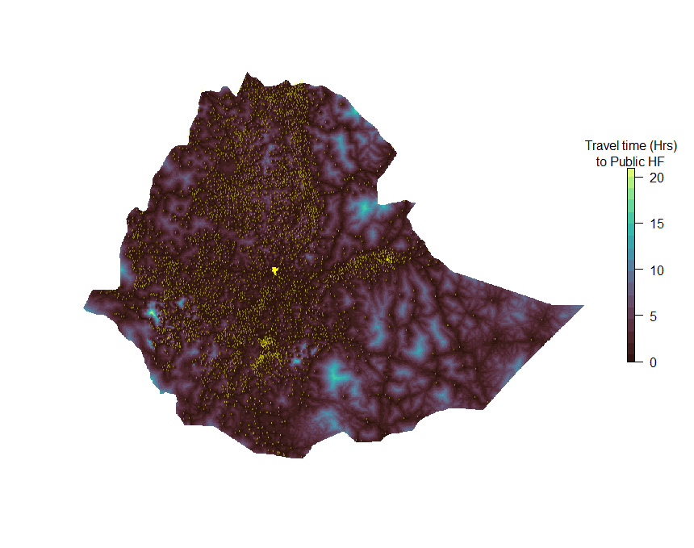
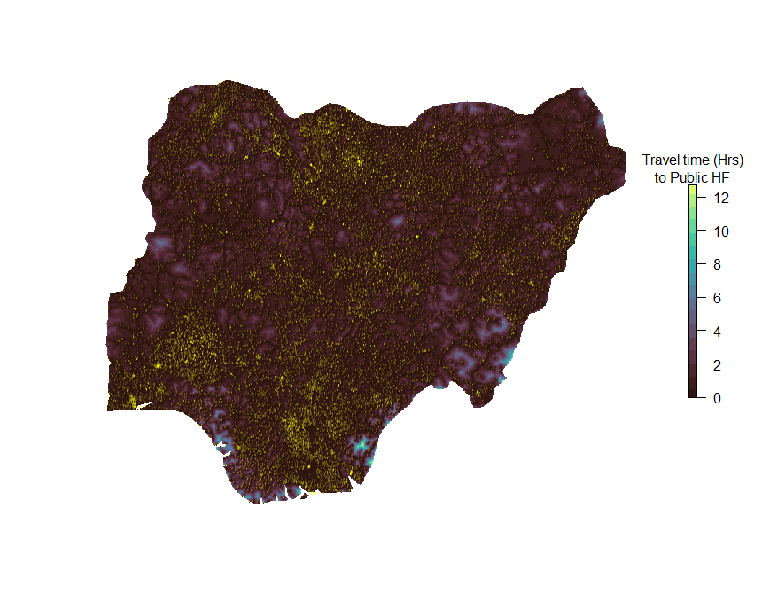

# Make Travel Time to Public Health Facilties Maps #

The script in this repo will help you quickly make a 1x1km grid cell map of travel time to public health facilities for any country in Africa. 

It uses as input all public data. I am very grateful for these awesome resources to have been made publicly available.  Health facility locations are available from [A spatial database of health facilities managed by the public health sector in sub Saharan Africa](https://www.nature.com/articles/s41597-019-0142-2) by Joseph Maina et al. as well as a [Friction Surface](https://map.ox.ac.uk/research-project/accessibility_to_cities/) by Dan Weiss et al over at the [Malaria Atlas Project]().

The code run in under 5 minutes on my laptop. Once the rasters are made there will be lots more interesting analysis to do, for example by combining with population rasters from [WorldPop](https://www.worldpop.org/) or [HRSL](https://research.fb.com/downloads/high-resolution-settlement-layer-hrsl/), or maps of intervention coverage and health outcomes from [IHME-LBD](http://www.healthdata.org/lbd). 

Good luck, happy mapping!

Here are two example outputs for Ethiopia and Nigeria, respectively (the yellow dots are the health facility locations):

# Some caveats:

* Please read both papers describing the input and be aware of data limitations and assumptions. Most importantly from my perspective:
  * This is a list of publicly run health facilities only and all levels of HF are treated equally here.
  * Travelers are assumed to take the fastest available mode and there is no accounting for variation in travel amongst individuals orby season.
